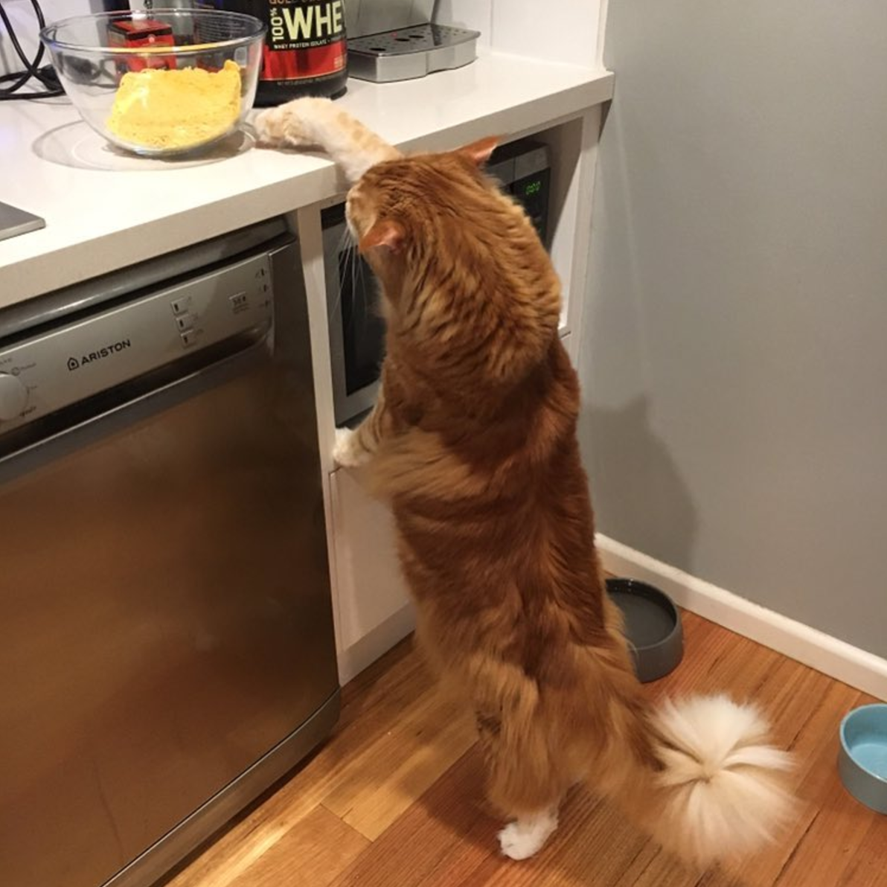

*****
Title
*****

Any non-alphanumeric character can be used for overline/underline or just underline.

Automatic Table of Contents:

.. contents::
    :local:
    :depth: 1
    :backlinks: none

========
Synopsis
========
Description of this project.

======================
Installation and Usage
======================

Smaller font subtitle
---------------------
To install `this program`, run the following command:: 

 command_preceded_by_spacing

*Do not* and I mean **do not** prefix shell commands with '$' unless the command output is shown in the same code block.

- Bullet point
`Hyperlink <https://www.google.com/>`_

`Hyperlink2`_

#. Auto-enumerated list starts here.
#. New item
#. New item

.. _Hyperlink2: https://www.gmail.com